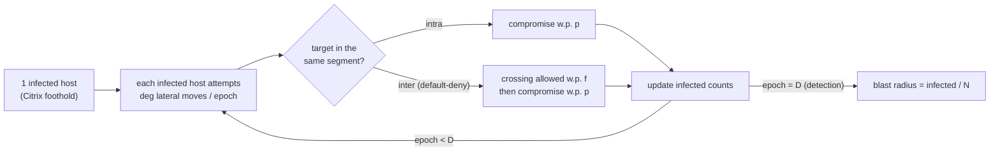
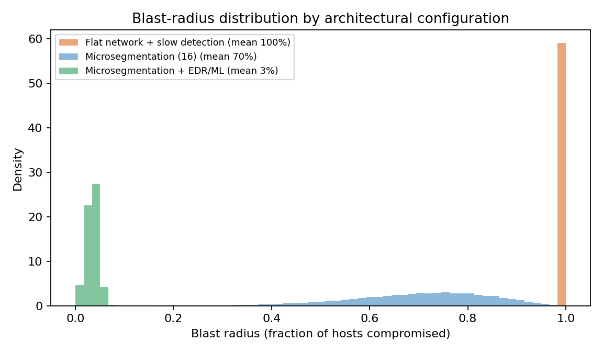

<div align="center">

# Blast-Radius Containment

**A reproducible Monte Carlo model of ransomware lateral propagation and its containment by Zero Trust microsegmentation and behavioral detection.**

[](https://doi.org/10.5281/zenodo.XXXXXXX)
[](https://opensource.org/licenses/Apache-2.0)
[](https://creativecommons.org/licenses/by/4.0/)
[](https://www.python.org/)
[-brightgreen.svg)](./tests)
[](./output/hash-chain.md)
[](https://colab.research.google.com/github/ulissesflores/blast-radius-containment/blob/main/colab/replication.ipynb)

</div>

> [!IMPORTANT]
> **Finding.** Microsegmentation is *necessary but not sufficient*: under a slow
> detection window a 16-segment network still loses ~70% of hosts. Pairing it
> with faster behavioral detection collapses the blast radius to **~3.5%** — a
> 96.5% reduction. The two controls reinforce each other.

This artifact is **motivated by** the 2024 Change Healthcare ransomware incident
— a public event in which a flat, perimeter-based network let ransomware
propagate across most of a national health-claims clearinghouse. It quantifies,
illustratively, how Zero Trust microsegmentation (default-deny east-west, per
NIST SP 800-207) combined with behavioral detection would have contained that
propagation. It is an **illustrative** stochastic model — not a forensic
reconstruction of any incident — but it is **fully deterministic, tested and
hash-anchored** so that every number can be reproduced and audited.

## What this contributes

1. **A transparent propagation model** — a segment-level susceptible–infected
   contact process with bounded fan-out and default-deny east-west leakage
   (`blast_radius.py`; spec in [`docs/algorithm.md`](docs/algorithm.md)).
2. **Quantified, CI-backed results at scale** — 400 000 Monte Carlo replicates
   with 95% confidence intervals and a one-at-a-time **sensitivity analysis**
   showing the conclusion is robust to the parameters ([`docs/findings.md`](docs/findings.md)).
3. **A machine-independent reproducibility guarantee** — a SHA-256 chain of
   truth binding source code and numeric results, regenerable on any machine
   ([`output/hash-chain.md`](output/hash-chain.md); see *Why the hash chain* below).

## Model at a glance



`N` = hosts, `S` = segments, `deg` = lateral reach, `p` = compromise-on-reach,
`f` = permitted east-west fraction, `D` = detection window (epochs). An **epoch**
is a *dimensionless* propagation round, not a calendar day — detection speed is a
ratio (fast = 3× faster). Full notation in [`docs/algorithm.md`](docs/algorithm.md).

<div align="center">

</div>

## Quick start

**Google Colab (zero setup)** — open the badge above, or
[`colab/replication.ipynb`](colab/replication.ipynb). It embeds the model, runs
400k replicates and verifies its own SHA-256 hashes.

**Local:**

```bash
git clone https://github.com/ulissesflores/blast-radius-containment
cd blast-radius-containment
pip install -r requirements.txt
python -m pytest -q          # 7 tests: determinism, bit-parity, monotonicity
python run_all.py            # ~20 s -> output/results.json + figures
python make_provenance.py    # -> output/provenance.json + hash-chain.md
```

**Docker (sealed runtime):**

```bash
docker build -t blast-radius .
docker run --rm blast-radius   # runs tests + experiment + provenance
```

## Five-step replication protocol

1. **Verify source integrity** — `shasum -a 256 blast_radius.py run_all.py` and
   compare against [`output/hash-chain.md`](output/hash-chain.md).
2. **Run the test suite** — `python -m pytest -q` (7 tests must pass).
3. **Run the experiment** — `python run_all.py` (deterministic, seed 513).
4. **Bind the chain of truth** — `python make_provenance.py`.
5. **Verify reproducibility** — repeat step 3–4 and confirm `chain_hash` is
   unchanged.

> [!WARNING]
> If any source file or any numeric result changes, `chain_hash` changes. A
> mismatch means the chain is broken — the published results no longer
> correspond to the published code.

## Why the hash chain (everything in the open)

Reproducibility is a claim, and a claim must be **falsifiable**. The chain of
truth makes ours falsifiable by anyone:

- `make_provenance.py` computes a single **`chain_hash`** = SHA-256 over the
  **source code** + the **numeric results** (`results.json`, `raw_replicas.jsonl`).
- Those numeric results are **bit-reproducible from the fixed seed** (numpy
  `default_rng`), so re-running on **any machine with a compatible numpy yields
  the same `chain_hash`**. The published hash is therefore a public, checkable
  fingerprint of "this code produced exactly these numbers".
- Environment (OS, library versions), the git commit and the figure-PNG hashes
  **vary by machine/toolchain** (e.g. matplotlib/freetype changes PNG bytes), so
  they are **recorded as informational but deliberately excluded from the hash**
  — otherwise the guarantee would not survive leaving this laptop.

This is what lets us invite anyone into the kitchen: change one constant, re-run,
and the fingerprint moves. Nothing is hidden behind "trust me".

## Results (seed 513, 400 000 replicates)

| Configuration | Mean blast radius | 95% CI | P10–P90 |
|---|---|---|---|
| Flat network + slow detection | **100.0%** | ±0.001 pp | 100–100% |
| Microsegmentation (16) + slow detection | **70.2%** | ±0.04 pp | 51.6–87.0% |
| Microsegmentation + behavioral EDR/ML | **3.5%** | ±0.004 pp | 1.8–4.9% |

Reductions vs. flat: **29.8%** (segmentation alone), **96.5%** (defense in depth).
Sensitivity ordering robust across all 9 perturbation cells.

> [!NOTE]
> The means barely move with more replicates — that is expected. More Monte Carlo
> samples shrink the **confidence interval**, not the **expected value**: the mean
> was already accurate at small sample sizes. The value of 400k is *precision and
> a defensible chain*, not different numbers. Changing the numbers would require a
> richer model — see [`ROADMAP.md`](ROADMAP.md) (graph-based v2.0).

## Layout

```
blast-radius-containment/
├── blast_radius.py        # core model + experiments
├── run_all.py             # runs everything -> output/
├── make_provenance.py     # SHA-256 chain of truth
├── tests/                 # 7 pytest tests (determinism / bit-parity / monotonicity)
├── colab/                 # self-contained replication notebook
├── docs/                  # algorithm.md, findings.md (English)
├── output/               # canonical results + figures (committed for audit)
├── Dockerfile · requirements.txt · pyproject.toml
└── CITATION.cff · .zenodo.json · codemeta.json
```

## Documentation

- [`docs/algorithm.md`](docs/algorithm.md) — model specification, pseudocode, parameter grounding, limitations.
- [`docs/findings.md`](docs/findings.md) — full results, sensitivity, frontier.
- [`output/hash-chain.md`](output/hash-chain.md) — auto-generated audit trail.
- [`ROADMAP.md`](ROADMAP.md) — planned v2.0 (explicit host-graph topology).

## Citation

> [!NOTE]
> The DOI is minted on the first public release; replace `XXXXXXX` below and in
> the badge with the Zenodo identifier. Machine-readable metadata: [`CITATION.cff`](CITATION.cff).

```bibtex
@software{flores_blast_radius_containment_2026,
  author       = {Flores, Carlos Ulisses},
  title        = {{Blast-Radius Containment: a reproducible Monte Carlo
                   model of ransomware lateral propagation under Zero
                   Trust microsegmentation}},
  year         = {2026},
  publisher    = {Zenodo},
  version      = {1.0.0},
  doi          = {10.5281/zenodo.XXXXXXX},
  url          = {https://doi.org/10.5281/zenodo.XXXXXXX},
  orcid        = {0000-0002-6034-7765}
}
```

## License

Code is licensed under **Apache-2.0** ([`LICENSE`](LICENSE)); documentation and
figures under **CC BY 4.0**.

## Anchor references

- Rose, S., Borchert, O., Mitchell, S. & Connelly, S. (2020). *Zero Trust Architecture* (NIST SP 800-207). https://doi.org/10.6028/NIST.SP.800-207
- Rais, R., Morillo, C., Gilman, E. & Barth, D. (2024). *Zero Trust Networks* (2nd ed.). O'Reilly.
- Anderson, R. J. (2020). *Security Engineering* (3rd ed.). Wiley.

## Contact

Carlos Ulisses Flores · ORCID [0000-0002-6034-7765](https://orcid.org/0000-0002-6034-7765).
Reproducibility issues and scientific inquiries: GitHub Issues.
